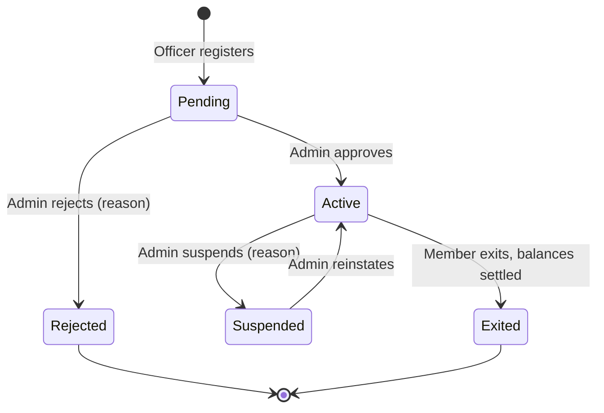
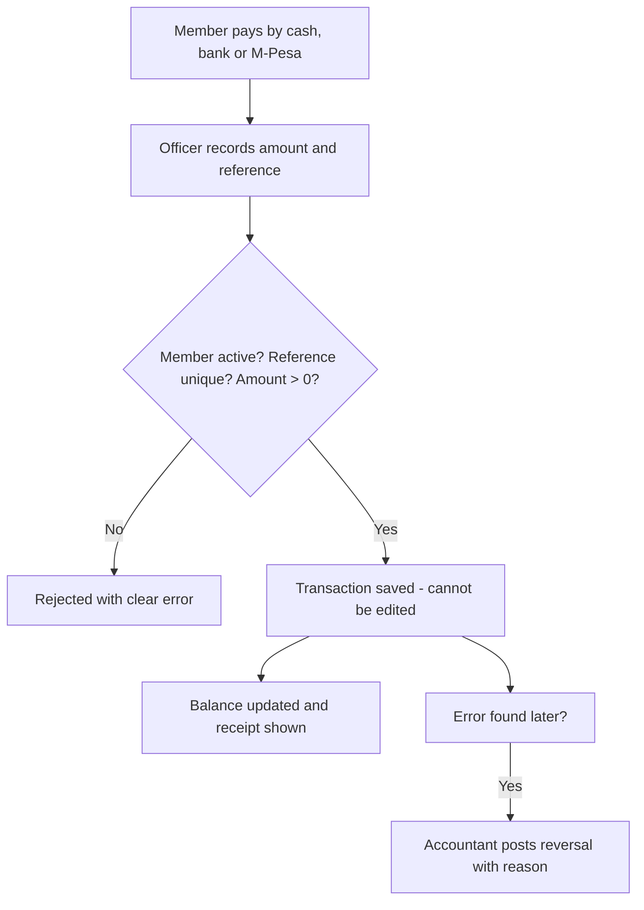
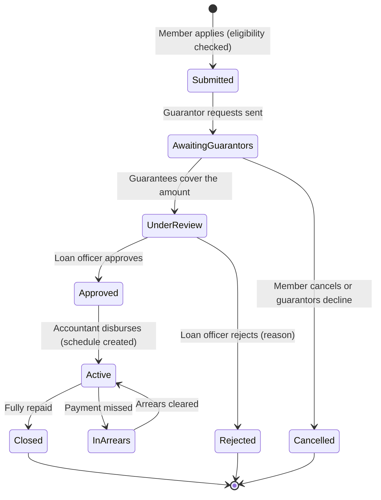

# Workflows

## 1. Member lifecycle

```mermaid
stateDiagram-v2
    [*] --> Pending: Officer registers
    Pending --> Active: Admin approves
    Pending --> Rejected: Admin rejects (reason)
    Active --> Suspended: Admin suspends (reason)
    Suspended --> Active: Admin reinstates
    Active --> Exited: Member exits, balances settled
    Rejected --> [*]
    Exited --> [*]
```

## 2. Contribution

```mermaid
flowchart TD
    A[Member pays by cash, bank or M-Pesa] --> B[Officer records amount and reference]
    B --> C{Member active? Reference unique? Amount > 0?}
    C -- No --> D[Rejected with clear error]
    C -- Yes --> E[Transaction saved - cannot be edited]
    E --> F[Balance updated and receipt shown]
    E --> G[Error found later?]
    G -- Yes --> H[Accountant posts reversal with reason]
```

## 3. Loan

```mermaid
stateDiagram-v2
    [*] --> Submitted: Member applies (eligibility checked)
    Submitted --> AwaitingGuarantors: Guarantor requests sent
    AwaitingGuarantors --> UnderReview: Guarantees cover the amount
    AwaitingGuarantors --> Cancelled: Member cancels or guarantors decline
    UnderReview --> Approved: Loan officer approves
    UnderReview --> Rejected: Loan officer rejects (reason)
    Approved --> Active: Accountant disburses (schedule created)
    Active --> Closed: Fully repaid
    Active --> InArrears: Payment missed
    InArrears --> Active: Arrears cleared
    Closed --> [*]
    Rejected --> [*]
    Cancelled --> [*]
```